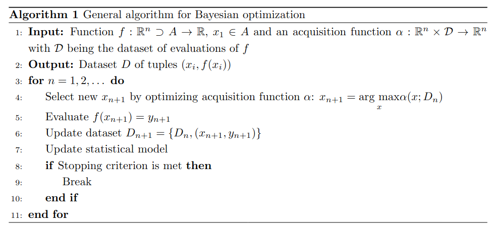

Bayesian Optimization
==========================

OpenDiHu can be used to find optimal anatomical and physiological parameters. In the `optimization repository <https://github.com/opendihu/optimization>`_. We povide a Bayesian optimization framework designed for OpenDiHu simulations. 

This optimization method is designed for continuous black box functions, because it uses as few function evaluations as possible and statistical methods for searching the maximum. 

The general optimization process follows this algorithm:

The function :math:`f` is usually an OpenDiHu simulation. 

Acquisition functions
-------------------------------

The implemented acquisition functions are:

- Expected improvement
- Probability of improvement
- Knoledge gradient
- Entropy search 

The default and recommended one is the Entropy search acquisition function.

Statistical model
---------------------

As statistical model we are using a Gaussian Process with kernel and mean functions.

Implemented kernel functions are the Matérn kernel with :math:`\nu\in\{0.5, 1.5, 2.5\}` and the RBF kernel. Deafault is the Matérn kernel with :math:`\nu=0.5`.

The mean functions are the constant and zero mean with the constant mean as default.